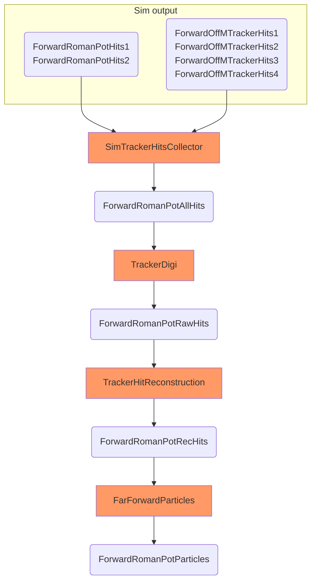

```mermaid
flowchart TB
  classDef alg fill:#f96;
  subgraph Sim output
    direction TB
    i1(ForwardRomanPotHits1<br/>ForwardRomanPotHits2)
    i2(ForwardOffMTrackerHits1<br/>ForwardOffMTrackerHits2<br/>ForwardOffMTrackerHits3<br/>ForwardOffMTrackerHits4)
  end

  i1 --> a1[SimTrackerHitsCollector]:::alg 
  i2 --> a1

  a1 --> mi1(ForwardRomanPotAllHits)
  mi1 --> a2[TrackerDigi]:::alg 
  a2 --> mi2(ForwardRomanPotRawHits)
  mi2 --> a3[TrackerHitReconstruction]:::alg 
  a3 --> mi3(ForwardRomanPotRecHits)
  mi3-->a4[FarForwardParticles]:::alg 
  a4 --> mi4(ForwardRomanPotParticles)
```